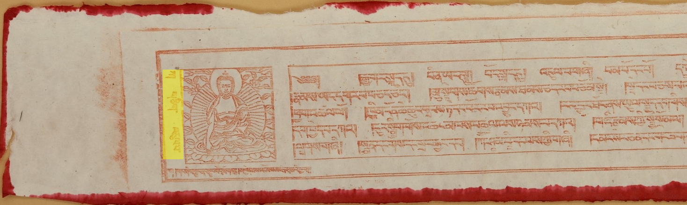
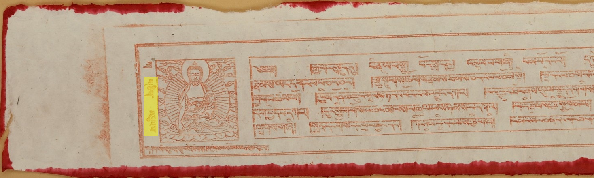

# Adarsha Web Parser

Creates OPF from Adarsha

### Data format

work = [pecha_name,pbs]

### Environment Setup
 - python3
 - openpecha
 - beautiful soup
 - requests


### Usage

```python
{!../../docs_src/importers/adarsha/tutorial001.py!}
```

## Tagset

### Pagination tags

#### `[1]`

**Type:** Pagination

**Syntax:** 
```
{
  "data": [
    {
      "pbId": ...,
    }
  ]
}
```
**Description:** From value of pbId,volume and img number can be extracted 

**Text Sample:**

```
{
  "data": [
    {
      "pbId": "29-1-1a",
    }
  ]
}
```


#### `[1a]`

**Type:** Volume

**Syntax:**
```
{
  "data": [
    {
      "pbId": volume - ... - ...,
    }
  ]
}
```

**Description:** Tag for volume in traditional pecha layout. 

**Text Sample:**

```
{
  "data": [
    {
      "pbId": "29-1-1a",
    }
  ]
}
```


#### `[1b]`

**Type:** ImgNum

**Syntax:**
```
{
  "data": [
    {
      "pbId": ... - ... - imgnum,
    }
  ]
}
```

**Description:** Tag for image numbers in traditional pecha layout.

**Text Sample:**

```
{
  "data": [
    {
      "pbId": "29-1-1a",
    }
  ]
}
```



