# Dharm Ebooks

## Prerequisite

### Data format
 
 Input Data is

- Dharma ebook(.epub)

Dharma Ebook[link](https://gitlab.com/bdrc-data/etextcontents).


## Usage

```python
{!../../docs_src/importers/dharma_ebooks/tutorial001.py!}
```

- First you need to import `Path` from `pathlib` ,`ebook_to_opf` function from `dharma_ebook` module.

- Then you need to give a pecha_id or if you sent None it will create standard Openpecha pecha id.

- you will need to create a folder called data and then a folder called epubs and put the dharma ebook (.epub) in the epubs folder.

- next you will us the name of the ebook to create the `epub_path` and `data_path`.

- After that you will pass those paths and to create the opf of the epub.

- If the script runs without any error it will return the `pecha_path`.


**Note**

You will be required to have the ebook in .epub format. 


# Tagsets

## HTML paragraph tags


**Type:** Big-title

**Syntax:** `<p class="Big-title">...</p>`

**Description:** this tag indicates the Big title

**Text Sample:**

```
<p class="Big-title">༈ ཇོ་མཇལ་ཁྲིད་ཡིག་ཡིད་བཞིན་ནོར་བུ། </p>
```
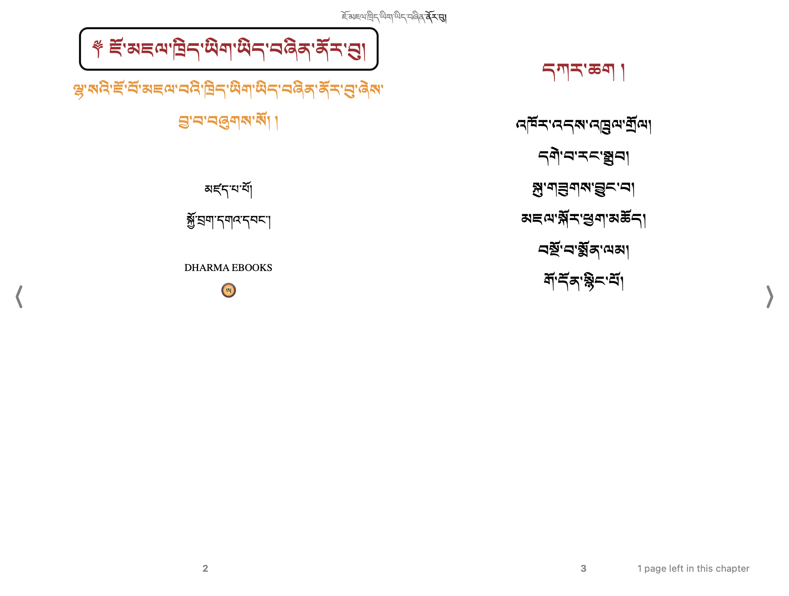


**Type:** Book-title

**Syntax:** `<p class="Book-title">...</p>`

**Description:** this tag indicates the Book title

**Text Sample:**

```
<p class="Book-title">ལྷ་སའི་ཇོ་བོ་མཇལ་བའི་ཁྲིད་ཡིག་ཡིད་བཞིན་ནོར་བུ་ཞེས་བྱ་བ་བཞུགས་སོ། །</p>
```
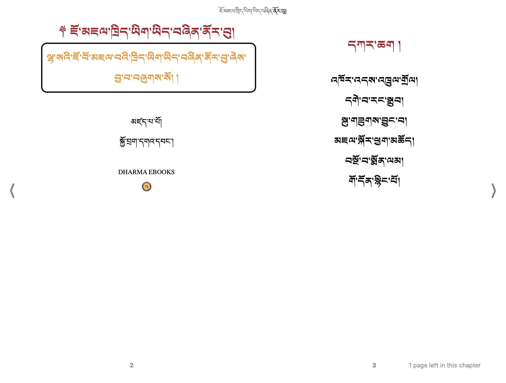


**Type:** མཛད་པ་པོ།

**Syntax:** `<p class="མཛད་པ་པོ།">...</p>`

**Description:** this tag indicates the creator or author

**Text Sample:**

```
<p class="མཛད་པ་པོ།">མཛད་པ་པོ། </p>
```
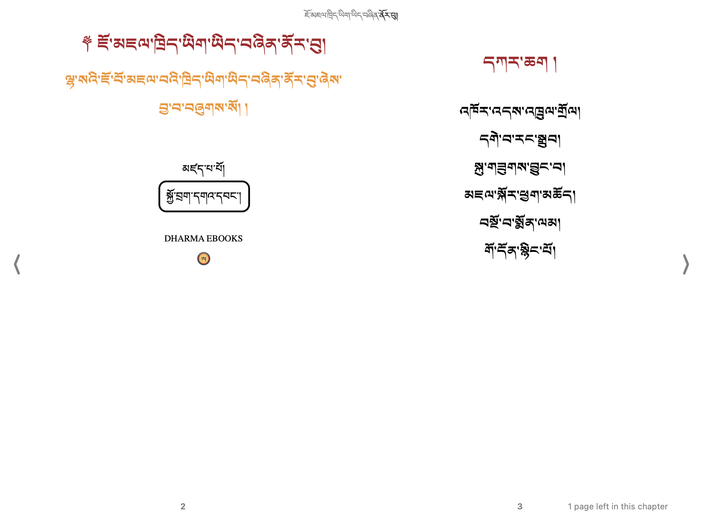


**Type:** publisher

**Syntax:** `<p class="publisher" lang="en-US" xml:lang="en-US">...</p>`

**Description:** this tag indicates the publisher

**Text Sample:**

```
<p class="publisher" lang="en-US" xml:lang="en-US">dharma Ebooks</p>
```
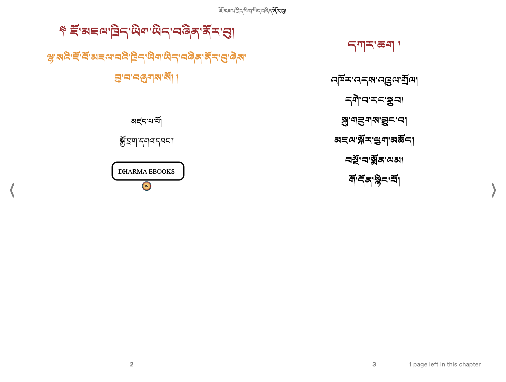


**Type:** Kar-chak

**Syntax:** `<p id="_idParaDest-1" class="Kar-chak"><a id="_idTextAnchor000"></a>...</p>`

**Description:** this tag indicates the Table of Content

**Text Sample:**

```
<p id="_idParaDest-1" class="Kar-chak"><a id="_idTextAnchor000"></a>དཀར་ཆག །</p>
```
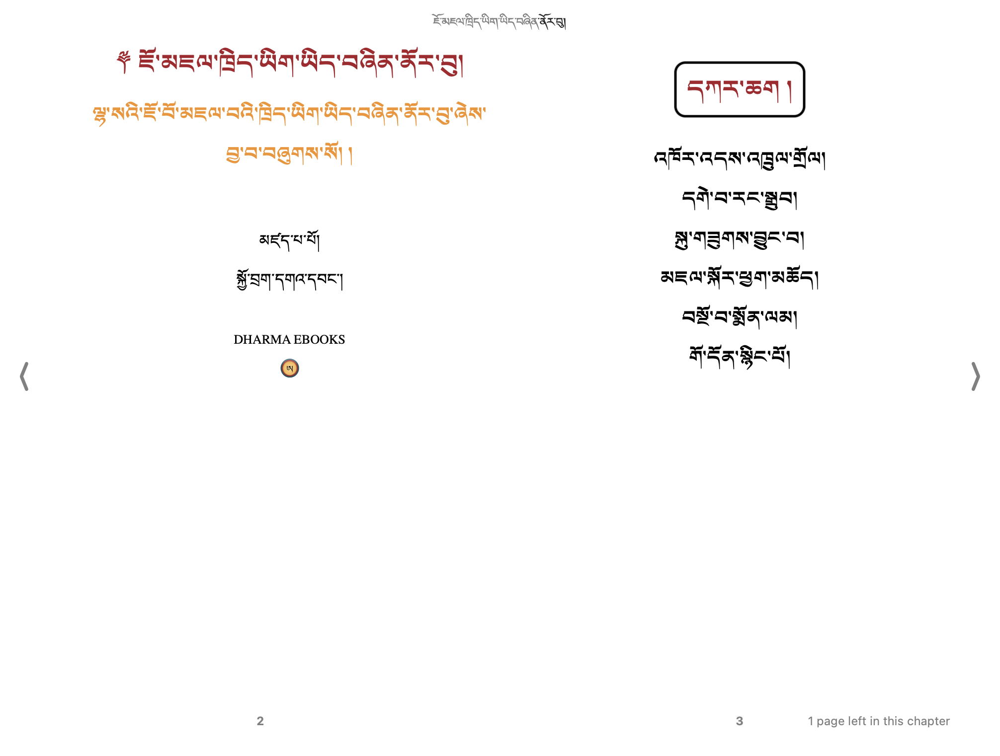


**Type:** TOC-Body-Text

**Syntax:** `<p class="TOC-Body-Text"><a href="../Text/jowo-1.xhtml#_idTextAnchor001">...</a></p>`

**Description:** this tag indicates the Table of Content`s body text

**Text Sample:**

```
<p class="TOC-Body-Text"><a href="../Text/jowo-1.xhtml#_idTextAnchor001">འཁོར་འདས་འཁྲུལ་གྲོལ། </a></p>
```
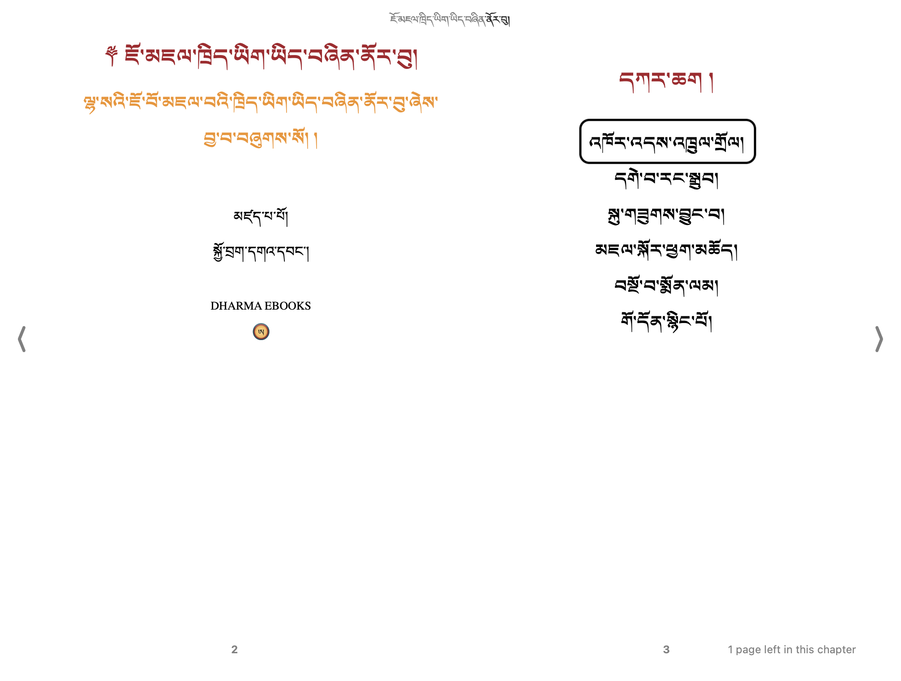


**Type:** tsik-che-first

**Syntax:** `<p class="tsik-che-first"><span class="CharOverride-1">...</span></p>`

**Description:** this tag indicates the tsik che first

**Text Sample:**

```
<p class="tsik-che-first"><span class="CharOverride-1">ན་མོ་ཤཱཀྱ་མུ་ན་ཡེ། </span></p>
```


**Type:** tsik-che

**Syntax:** `<p class="tsik-che">...</p>`

**Description:** this tag indicates the tsik che

**Text Sample:**

```
<p class="tsik-che">བྱང་ཆུབ་སེམས་བསྐྱེད་སྤྱོད་པ་རྒྱ་མཚོ་སྤྱད། །</p>
```
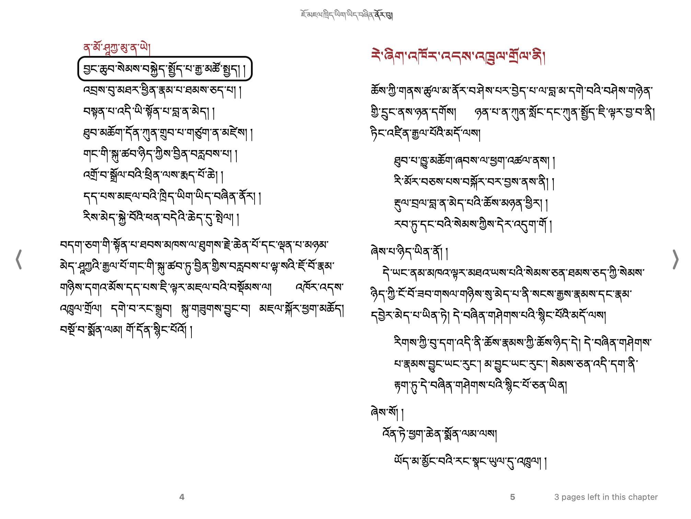


**Type:** tsik-che-last

**Syntax:** `<p class="tsik-che-last">...</p>`

**Description:** this tag indicates the tsik che last

**Text Sample:**

```
<p class="tsik-che-last">རིས་མེད་སྐྱེ་བོའི་ཕན་བདེའི་ཆེད་དུ་སྤེལ། །</p>
```
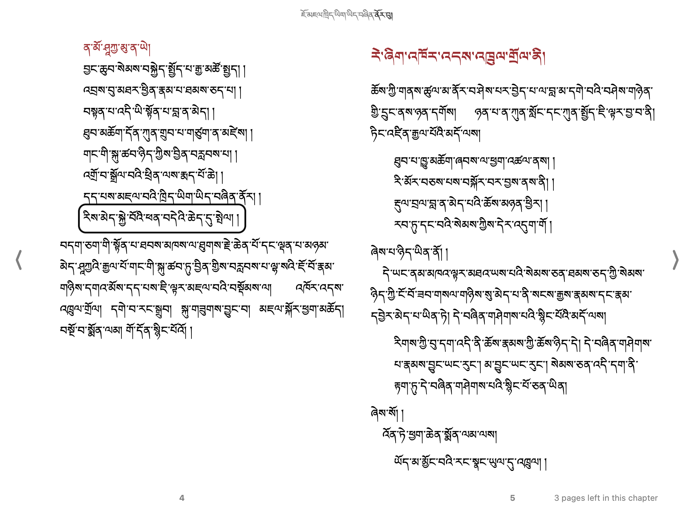


**Type:** copyrights

**Syntax:** `<p class="copyrights ParaOverride-1" lang="en-US" xml:lang="en-US" style="text-align: center;">...</p>`

**Description:** this tag indicates the copyrights

**Text Sample:**

```
<p class="copyrights ParaOverride-1" lang="en-US" xml:lang="en-US" style="text-align: center;">To translate request permission from Khenpo Ghawang or HH the 17th Karmapa</p>
```
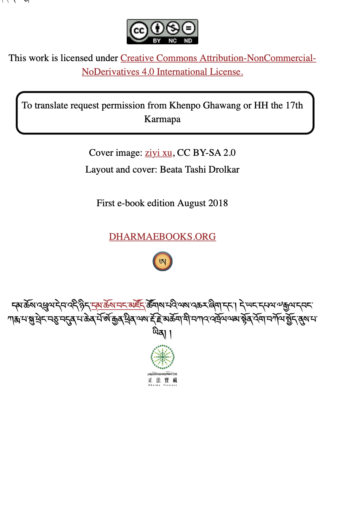


**Type:** text-first

**Syntax:** `<p class="text-first">...</p>`

**Description:** this tag indicates the text first

**Text Sample:**

```
<p class="text-first">བདག་ཅག་གི་སྟོན་པ་ཐབས་མཁས་ལ་ཐུགས་རྗེ་ཆེན་པོ་དང་ལྡན་པ་མཉམ་མེད་ཤཱཀྱའི་རྒྱལ་པོ་གང་གི་སྐུ་ཚབ་ཏུ་བྱིན་གྱིས་བརླབས་པ་ལྷ་སའི་ཇོ་བོ་རྣམ་གཉིས་དགའ་མོས་དད་པས་ཇི་ལྟར་མཇལ་བའི་བསྡོམས་ལ། འཁོར་འདས་འཁྲུལ་གྲོལ། དགེ་བ་རང་སྒྲུབ། སྐུ་གཟུགས་བྱུང་བ། མཇལ་སྐོར་ཕྱག་མཆོད། བསྔོ་བ་སྨོན་ལམ། གོ་དོན་སྙིང་པོའོ། །</p>
```
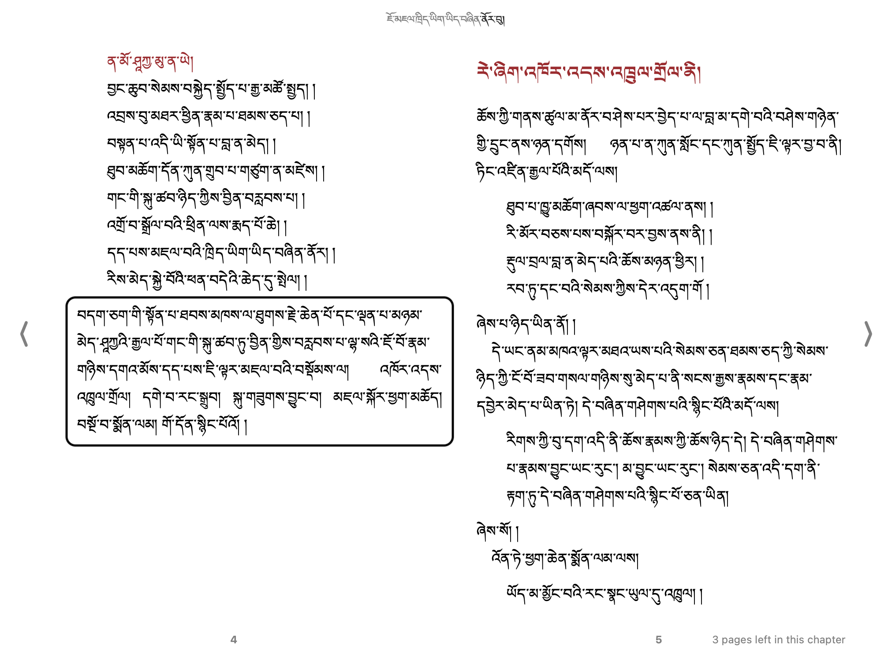


**Type:** text

**Syntax:** `<p class="text">...</p>`

**Description:** this tag indicates the text

**Text Sample:**

```
<p class="text">དེ་ཡང་ནམ་མཁའ་ལྟར་མཐའ་ཡས་པའི་སེམས་ཅན་ཐམས་ཅད་ཀྱི་སེམས་ཉིད་ཀྱི་ངོ་བོ་ཟབ་གསལ་གཉིས་སུ་མེད་པ་ནི་སངས་རྒྱས་རྣམས་དང་རྣམ་དབྱེར་མེད་པ་ཡིན་ཏེ། དེ་བཞིན་གཤེགས་པའི་སྙིང་པོའི་མདོ་ལས། </p>
```
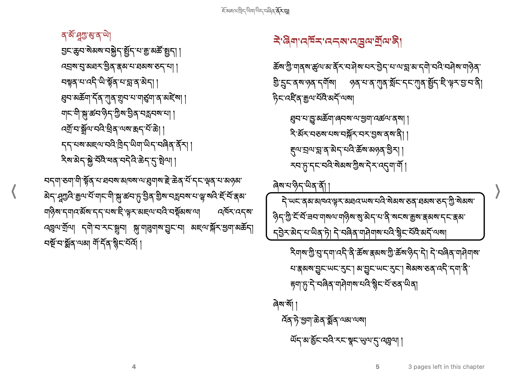


**Type:** quote

**Syntax:** `<p class="quote">...</p>`

**Description:** this tag indicates the quote

**Text Sample:**

```
<p class="quote">རིགས་ཀྱི་བུ་དག་འདི་ནི་ཆོས་རྣམས་ཀྱི་ཆོས་ཉིད་དེ། དེ་བཞིན་གཤེགས་པ་རྣམས་བྱུང་ཡང་རུང་། མ་བྱུང་ཡང་རུང་། སེམས་ཅན་འདི་དག་ནི་རྟག་ཏུ་དེ་བཞིན་གཤེགས་པའི་སྙིང་པོ་ཅན་ཡིན། </p>
```
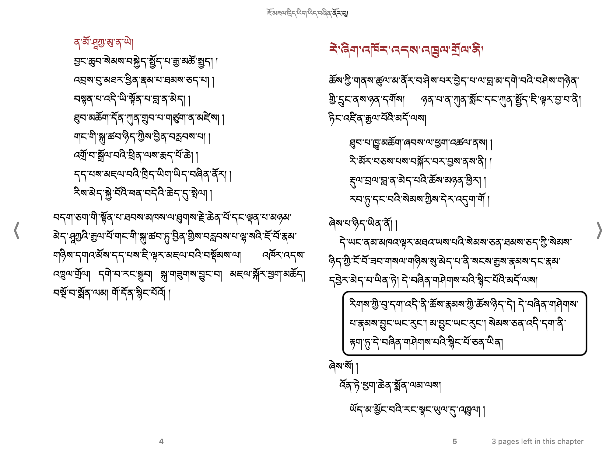


**Type:** subtitle

**Syntax:** `<p id="_idParaDest-2" class="subtitle"><a id="_idTextAnchor001"></a>...</p>`

**Description:** this tag indicates the subtitle

**Text Sample:**

```
<p id="_idParaDest-2" class="subtitle"><a id="_idTextAnchor001"></a>རེ་ཞིག་འཁོར་འདས་འཁྲུལ་གྲོལ་ནི། </p>
```
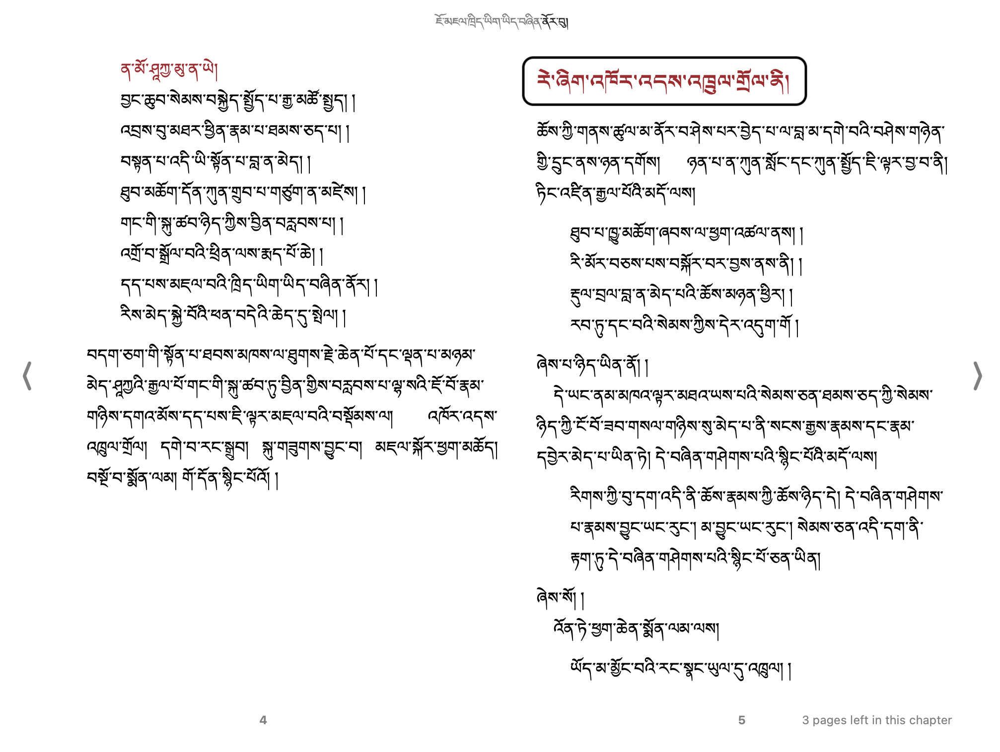


**Type:** Tibetan-Chapter

**Syntax:** `<p class="Tibetan-Chapter">...</p>`

**Description:** this tag indicates the Tibetan Chapter

**Text Sample:**

```
<p class="Tibetan-Chapter">ཐེག་པ་ཆེན་པོའི་གདམས་ངག་བློ་སྦྱོང་དོན་བདུན་མ།</p>
```
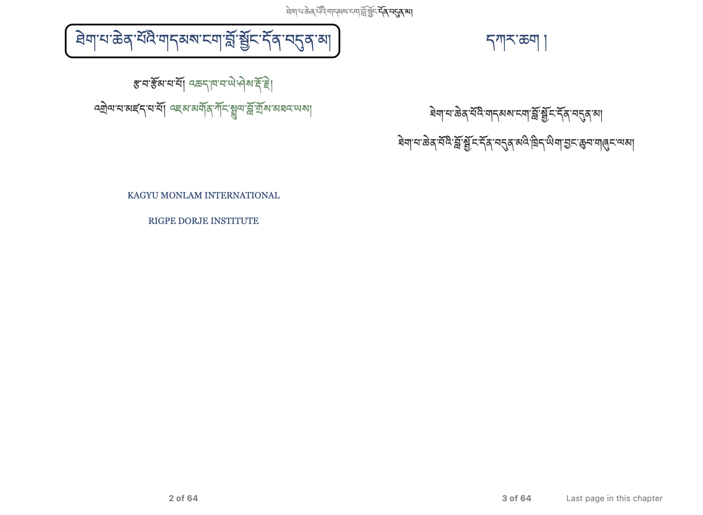


**Type:** Tibetan-Commentary-Non-Indent

**Syntax:** `<p class="Tibetan-Commentary-Non-Indent" style="text-align: center;">...</span></p>`

**Description:** this tag indicates the Tibetan Commentary with No indent

**Text Sample:**

```
<p class="Tibetan-Commentary-Non-Indent" style="text-align: center;"><span class="Credits-Titles-Publishers">Kagyu Monlam International</span></p>
```
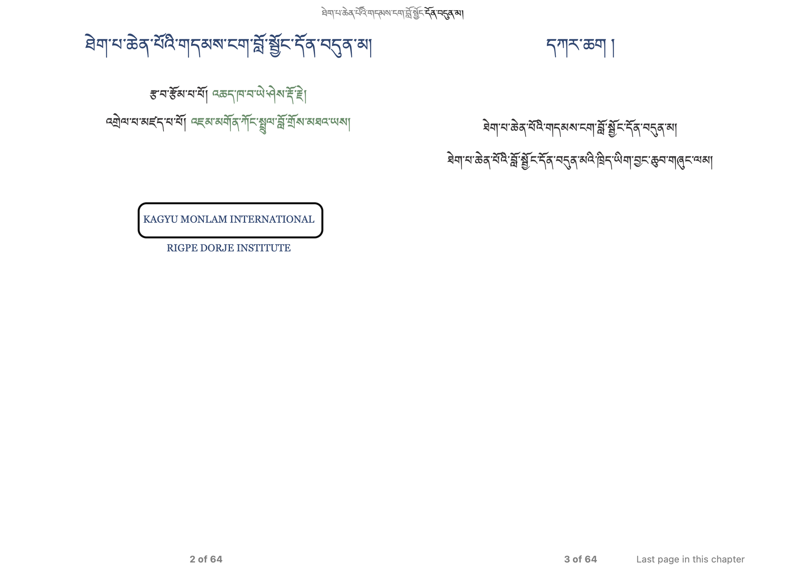


**Type:** Credits-Page_Front-Title

**Syntax:** `<p class="Credits-Page_Front-Title"><span class="Front-Page---Text-Titles _idGenCharOverride-2"><a href="../Text/RDI-SS-05-8.xhtml#root">...།</a><br/></span><span class="Front-Page---Text-Titles _idGenCharOverride-2"><a href="../Text/RDI-SS-05-9.xhtml#commentary">...</a><br/></span></p>`

**Description:** this tag indicates the credits on the page front title

**Text Sample:**

```
<p class="Credits-Page_Front-Title"><span class="Front-Page---Text-Titles _idGenCharOverride-2"><a href="../Text/RDI-SS-05-8.xhtml#root">ཐེག་པ་ཆེན་པོའི་གདམས་ངག་བློ་སྦྱོང་དོན་བདུན་མ།</a><br/></span><span class="Front-Page---Text-Titles _idGenCharOverride-2"><a href="../Text/RDI-SS-05-9.xhtml#commentary">ཐེག་པ་ཆེན་པོའི་བློ་སྦྱོང་དོན་བདུན་མའི་ཁྲིད་ཡིག་བྱང་ཆུབ་གཞུང་ལམ།</a><br/></span></p>
```
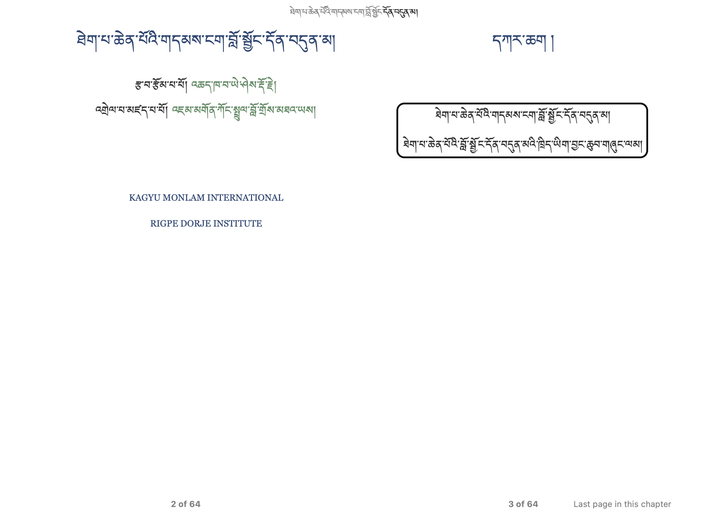

**Type:** Tibetan-Citations-in-Verse_Tibetan-Citations-First-Line

**Syntax:** `<p class="Tibetan-Citations-in-Verse_Tibetan-Citations-First-Line"><span class="Tibetan-External-Citations _idGenCharOverride-1">...</span></p>`

**Description:** this tag indicates the Tibetan citations in verse first line

**Text Sample:**

```
<p class="Tibetan-Citations-in-Verse_Tibetan-Citations-First-Line"><span class="Tibetan-External-Citations _idGenCharOverride-1">བྱམས་པའི་འཁོར་ལོ་སྔོན་དུ་འགྲོ། །</span></p>
```
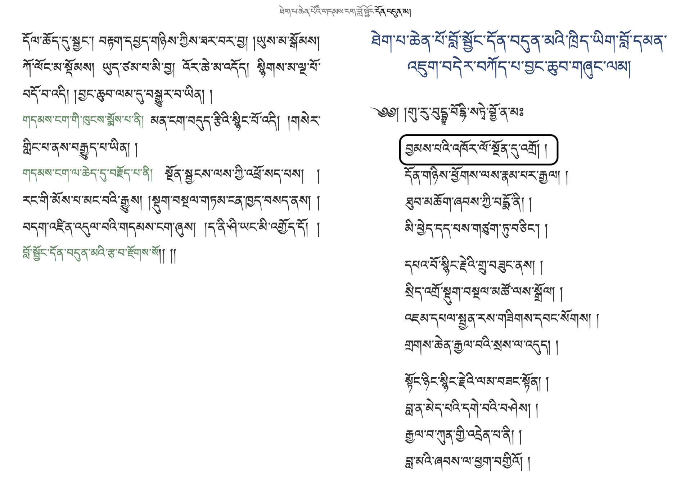


**Type:** Tibetan-Citations-in-Verse_Tibetan-Citations-Middle-Lines

**Syntax:** `<p class="Tibetan-Citations-in-Verse_Tibetan-Citations-Middle-Lines"><span class="Tibetan-External-Citations _idGenCharOverride-1">...</span></p>`

**Description:** this tag indicates the Tibetan citations in verse middle line

**Text Sample:**

```
<p class="Tibetan-Citations-in-Verse_Tibetan-Citations-Middle-Lines"><span class="Tibetan-External-Citations _idGenCharOverride-1">དོན་གཉིས་ཕྱོགས་ལས་རྣམ་པར་རྒྱལ། །</span></p>
```
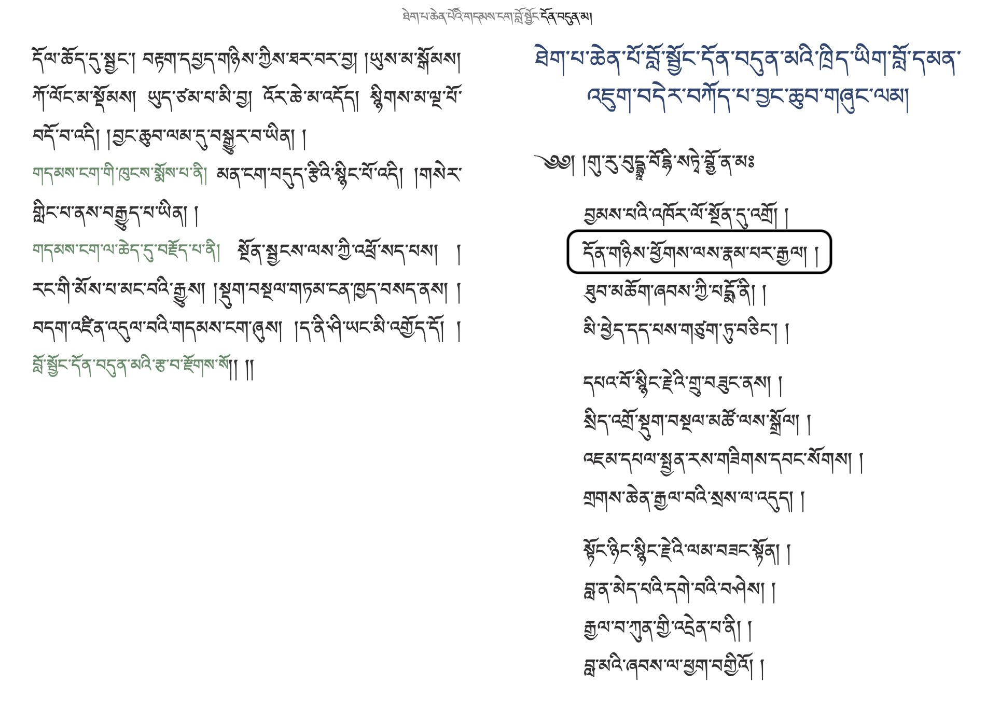


**Type:** Tibetan-Citations-in-Verse_Tibetan-Citations-Last-Line

**Syntax:** `<p class="Tibetan-Citations-in-Verse_Tibetan-Citations-Last-Line"><span class="Tibetan-External-Citations _idGenCharOverride-1">...</span></p>`

**Description:** this tag indicates the Tibetan citations in verse last line

**Text Sample:**

```
<p class="Tibetan-Citations-in-Verse_Tibetan-Citations-Last-Line"><span class="Tibetan-External-Citations _idGenCharOverride-1">ཟབ་པས་སངས་རྒྱས་འགྲུབ་དེ་འཆད། །</span></p>
```
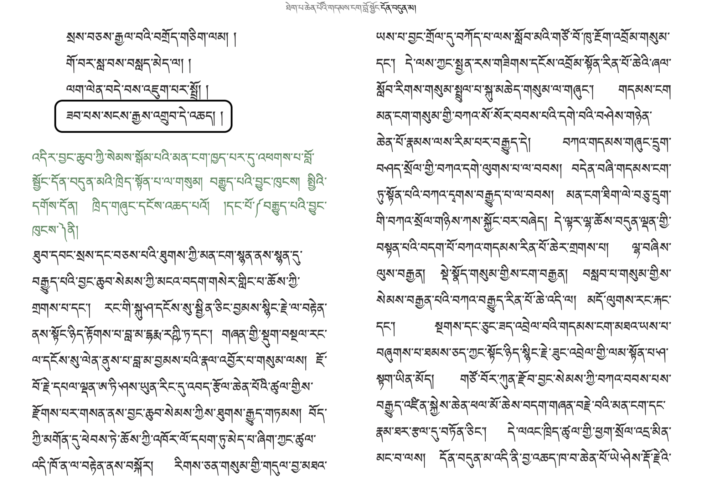


**Type:** Tibetan-Citations-in-Verse_Tibetan-Citations-First-line-alone

**Syntax:** `<p class="Tibetan-Citations-in-Verse_Tibetan-Citations-First-line-alone"><span class="Tibetan-Root-Text _idGenCharOverride-1">...</span></p>`

**Description:** this tag indicates the Tibetan citations in verse first line alone

**Text Sample:**

```
<p class="Tibetan-Citations-in-Verse_Tibetan-Citations-First-line-alone"><span class="Tibetan-Root-Text _idGenCharOverride-1">མ་སྐྱེས་རིག་པའི་གཤིས་ལ་དཔྱད། །</span></p>
```
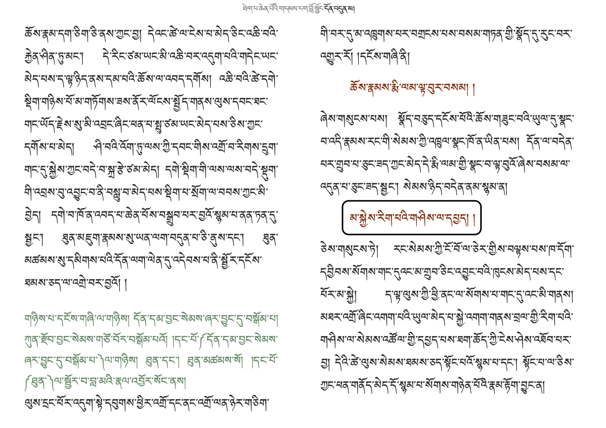


**Type:** Tibetan-Root-Text_Tibetan-Root-Text-First-line-alone

**Syntax:** `<p class="Tibetan-Root-Text_Tibetan-Root-Text-First-line-alone"><span class="Tibetan-Root-Text _idGenCharOverride-1">...</span></p>`

**Description:** this tag indicates the Tibetan Root Text First line alone

**Text Sample:**

```
<p class="Tibetan-Root-Text_Tibetan-Root-Text-First-line-alone"><span class="Tibetan-Root-Text _idGenCharOverride-1">དང་པོ་སྔོན་འགྲོ་དག་ལ་བསླབ། །</span></p>
```


**Type:** Tibetan-Regular-Indented

**Syntax:** `<p class="Tibetan-Regular-Indented"><span class="Tibetan-Commentary _idGenCharOverride-1">...</span></p>`

**Description:** this tag indicates the Tibetan Regular Indented line

**Text Sample:**

```
<p class="Tibetan-Regular-Indented"><span class="Tibetan-Commentary _idGenCharOverride-1">དེ་ལྟར་ཇོ་བོ་རྗེ་ལྷ་གཅིག་གི་བཀའ་སྲོལ་ལས་བྱོན་པའི་བློ་སྦྱོང་གི་གདམས་ངག་བརྒྱུད་པ་སོ་སོའི་ཁྲིད་སྲོལ་ཇི་སྙེད་ཅིག་བཞུགས་པའི་ཉམས་ལེན་གྱི་གནད་དོན་ཐམས་ཅད་དོན་བདུན་གྱི་གཞུང་འདིར་འདུ་བས། ཁྲིད་ཡིག་རྒྱས་བསྡུས་མང་པོ་དང༌། དེ་འཆད་པ་པོ་མཐའ་ཡས་པར་བཞུགས་པ་ལས། ཁྱད་པར་འཕགས་པ་རྒྱལ་སྲས་རིན་པོ་ཆེ་ཐོགས་མེད་ཞབས་དང་རྗེ་བཙུན་ཀུན་དགའ་སྙིང་པོའི་ཁྲིད་ཡིག་དག་ལས་ཁྲིད་ཚུལ་ཞིབ་མོར་ཐོབ་པར། སྐྱེས་ཆེན་ཟུང་གི་གསུང་གི་བདུད་རྩིའི་ཉིང་ཁུ་གཅིག་ཏུ་བསྡུས་ཏེ་ལས་དང་པོ་བས་གོ་སླ་གཙོར་བཏོན། གཞན་ཕན་གྱི་བསམ་པ་བཟང་པོ་ཁོ་ནས་འདུས་གསལ་དུ་བསྡེབས་པའོ། །</span></p>
```
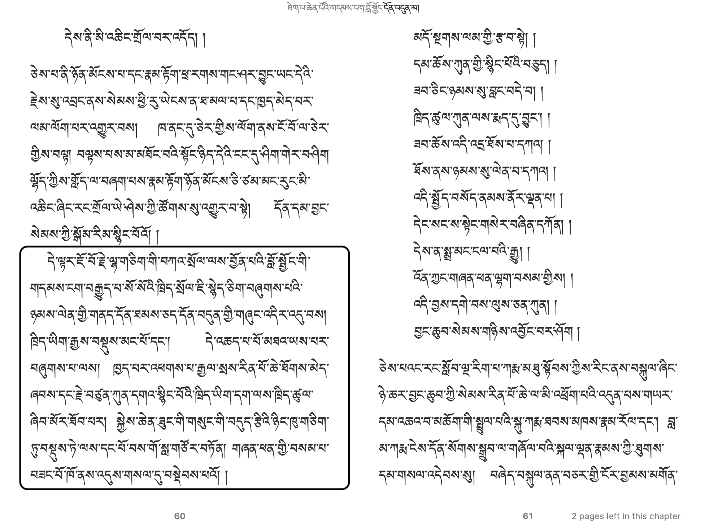


**Type:** Tibetan-Root-Text_Tibetan-Root-Text-First-Line

**Syntax:** `<p class="Tibetan-Root-Text_Tibetan-Root-Text-First-Line"><span class="Tibetan-Root-Text _idGenCharOverride-1">...</span></p>`

**Description:** this tag indicates the Tibetan Root Text First line

**Text Sample:**

```
<p class="Tibetan-Root-Text_Tibetan-Root-Text-First-Line"><span class="Tibetan-Root-Text _idGenCharOverride-1">གཏོང་ལེན་གཉིས་པོ་སྤེལ་མར་སྦྱང༌། །</span></p>
```
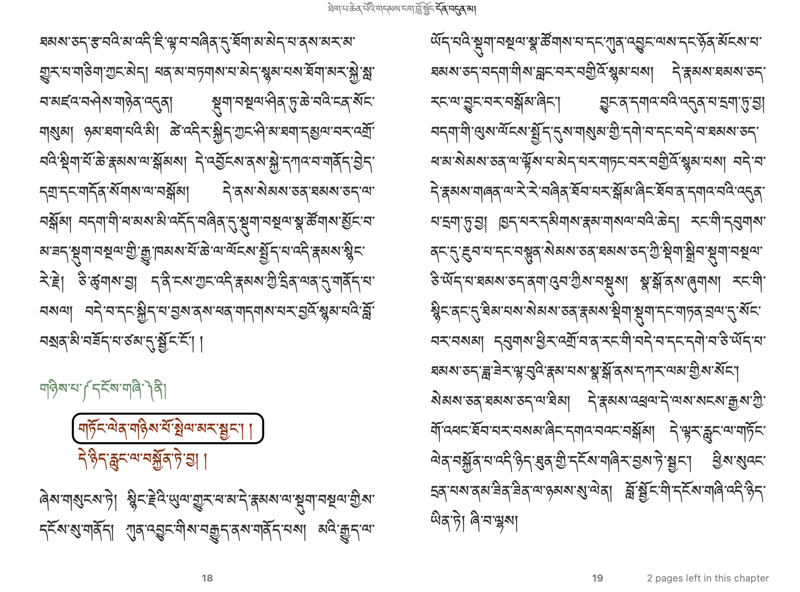


**Type:** Tibetan-Root-Text_Tibetan-Root-Text-Last-Line

**Syntax:** `<p class="Tibetan-Root-Text_Tibetan-Root-Text-Last-Line"><span class="Tibetan-Root-Text _idGenCharOverride-1">...</span></p>`

**Description:** this tag indicates the Tibetan Root Text Last line

**Text Sample:**

```
<p class="Tibetan-Root-Text_Tibetan-Root-Text-Last-Line"><span class="Tibetan-Root-Text _idGenCharOverride-1">དེ་ཉིད་རླུང་ལ་བསྐྱོན་ཏེ་བྱ། །</span></p>
```
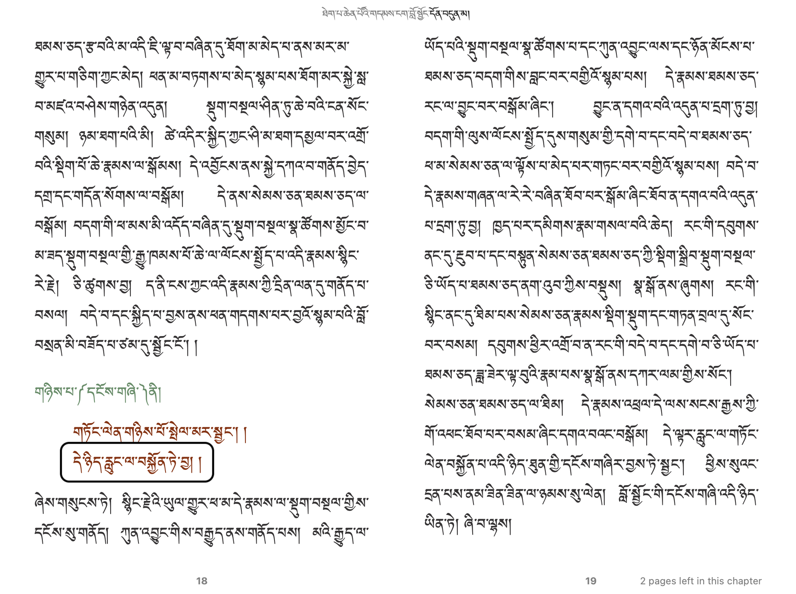


**Type:** Tibetan-Root-Text_Tibetan-Root-Text-MIddle-Lines

**Syntax:** `<p class="Tibetan-Root-Text_Tibetan-Root-Text-MIddle-Lines"><span class="Tibetan-Root-Text _idGenCharOverride-1">...</span></p>`

**Description:** this tag indicates the Tibetan Root Text MIddle Lines

**Text Sample:**

```
<p class="Tibetan-Root-Text_Tibetan-Root-Text-MIddle-Lines"><span class="Tibetan-Root-Text _idGenCharOverride-1">བྱང་ཆུབ་ལམ་དུ་བསྒྱུར་བ་ཡིན། །</span></p>
```
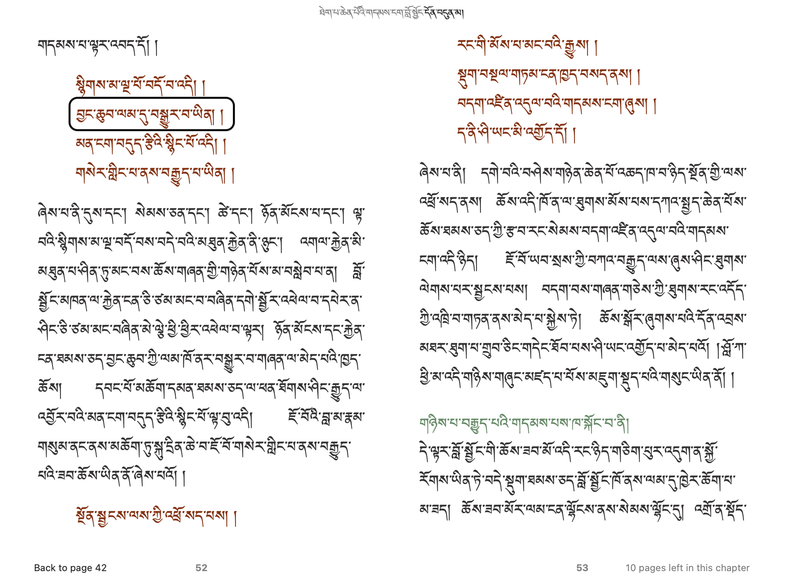


**Type:** Tibetan-Sabche

**Syntax:** `<p id="_idParaDest-127" class="Tibetan-Sabche"><span class="Tibetan-Sabche _idGenCharOverride-1">...</span></p>`

**Description:** this tag indicates the Tibetan Sabche

**Text Sample:**

```
<p id="_idParaDest-127" class="Tibetan-Sabche"><span class="Tibetan-Sabche _idGenCharOverride-1">འདིར་བྱང་ཆུབ་ཀྱི་སེམས་སྒོམ་པའི་མན་ངག་ཁྱད་པར་དུ་འཕགས་པ་བློ་སྦྱོང་དོན་བདུན་མའི་ཁྲིད་སྟོན་པ་ལ་གསུམ། བརྒྱུད་པའི་བྱུང་ཁུངས། སྤྱིའི་དགོས་དོན། ཁྲིད་གཞུང་དངོས་འཆད་པའོ། །དང་པོ་༼བརྒྱུད་པའི་བྱུང་ཁུངས་༽ནི།</span></p>
```
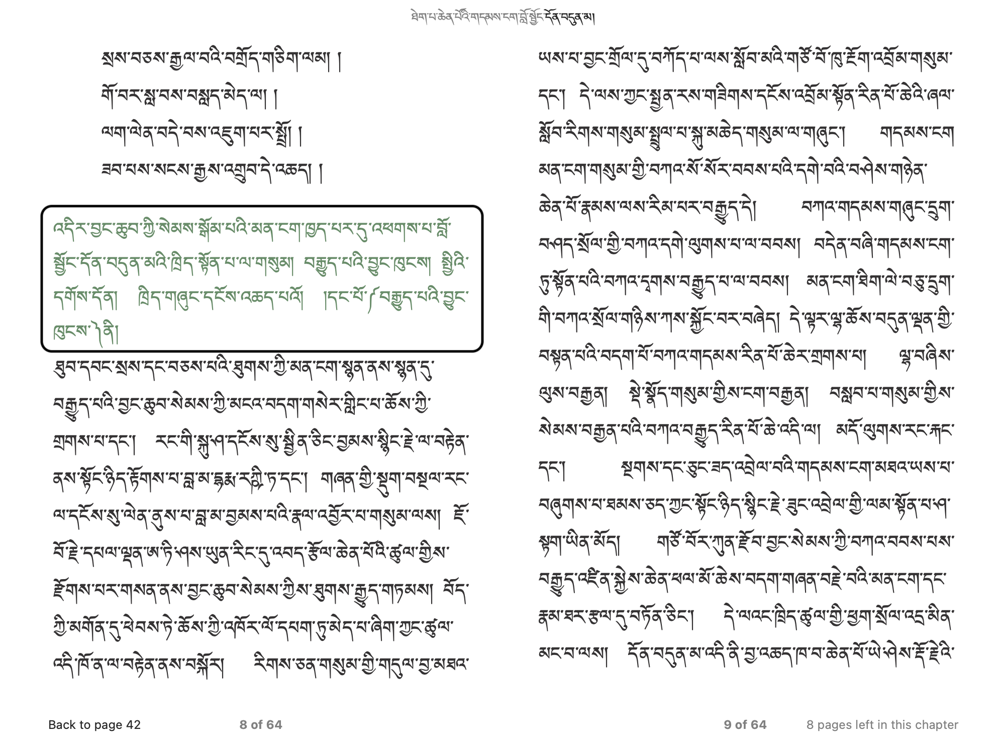


## HTML span tags


**Type:** Hyperlink

**Syntax:**
`
<span class="Hyperlink">...</span>`

**Description:** this span class tag indicates the hyperlink

**Text Sample:**

```
<span class="Hyperlink">Creative Commons Attribution-NonCommercial-NoDerivatives 4.0 International License.</span>
```
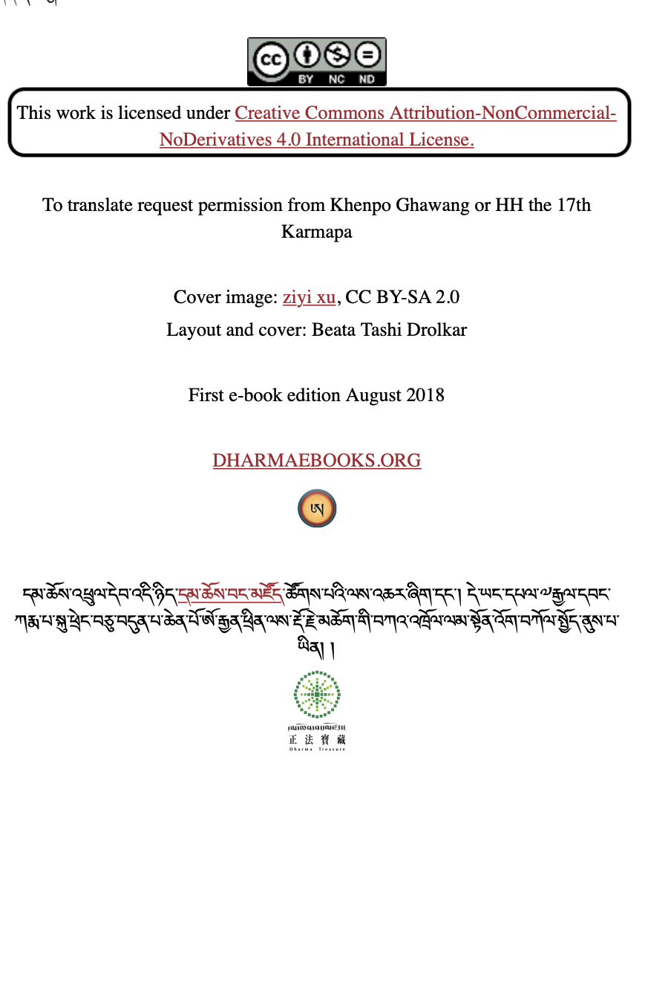


**Type:** CharOverride-1

**Syntax:**
`
<span class="CharOverride-1">...</span>`

**Description:** this span class tag indicates the character override

**Text Sample:**

```
<span class="CharOverride-1">ན་མོ་ཤཱཀྱ་མུ་ན་ཡེ། </span>
```
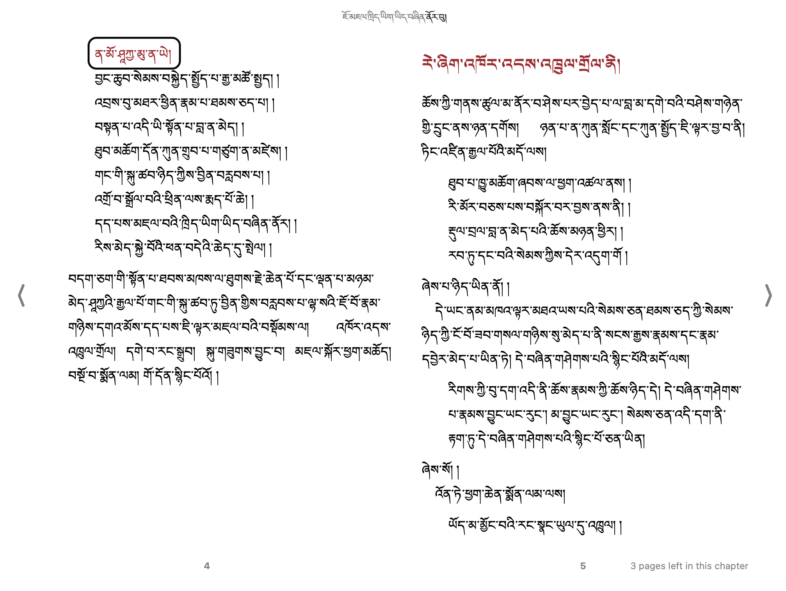


**Type:** Credits-Titles-Publishers

**Syntax:**
`
<span class="Credits-Titles-Publishers">...</span>`

**Description:** this span class tag indicates the Credits Titles Publishers

**Text Sample:**

```
<span class="Credits-Titles-Publishers">Kagyu Monlam International</span>
```


**Type:** Front-Page---Text-Titles

**Syntax:**
`
<span class="Front-Page---Text-Titles _idGenCharOverride-2"><a href="../Text/RDI-SS-05-8.xhtml#root">...</a><br/></span><span class="Front-Page---Text-Titles _idGenCharOverride-2"><a href="../Text/RDI-SS-05-9.xhtml#commentary">...</a><br/></span>`

**Description:** this span class tag indicates the Front Page Text Titles

**Text Sample:**

```
<span class="Front-Page---Text-Titles _idGenCharOverride-2"><a href="../Text/RDI-SS-05-8.xhtml#root">ཐེག་པ་ཆེན་པོའི་གདམས་ངག་བློ་སྦྱོང་དོན་བདུན་མ།</a><br/></span><span class="Front-Page---Text-Titles _idGenCharOverride-2"><a href="../Text/RDI-SS-05-9.xhtml#commentary">ཐེག་པ་ཆེན་པོའི་བློ་སྦྱོང་དོན་བདུན་མའི་ཁྲིད་ཡིག་བྱང་ཆུབ་གཞུང་ལམ།</a><br/></span>
```


**Type:** Tibetan-Commentary

**Syntax:**
`
<span class="Tibetan-Commentary _idGenCharOverride-1">...</span>`

**Description:** this span class tag indicates Tibetan Commentary

**Text Sample:**

```
span class="Tibetan-Commentary _idGenCharOverride-1">ཆོས་རྣམས་རྨི་ལམ་ལྟ་བུར་བསམ། །མ་སྐྱེས་རིག་པའི་གཤིས་ལ་དཔྱད། །གཉེན་པོ་ཉིད་ཀྱང་རང་སར་གྲོལ། །ངོ་བོ་ཀུན་གཞིའི་ངང་དུ་བཞག །ཐུན་མཚམས་སྒྱུ་མའི་སྐྱེས་བུར་བྱ། །གཏོང་ལེན་གཉིས་པོ་སྤེལ་མར་སྦྱང༌། །དེ་གཉིས་རླུང་ལ་བསྐྱོན་པར་བྱ། །ཡུལ་གསུམ་དུག་གསུམ་དགེ་རྩ་གསུམ། །སྤྱོད་ལམ་ཀུན་ཏུ་ཚིག་གིས་སྦྱང༌། །ལེན་པའི་གོ་རིམ་རང་ནས་བརྩམ། །</span>
```
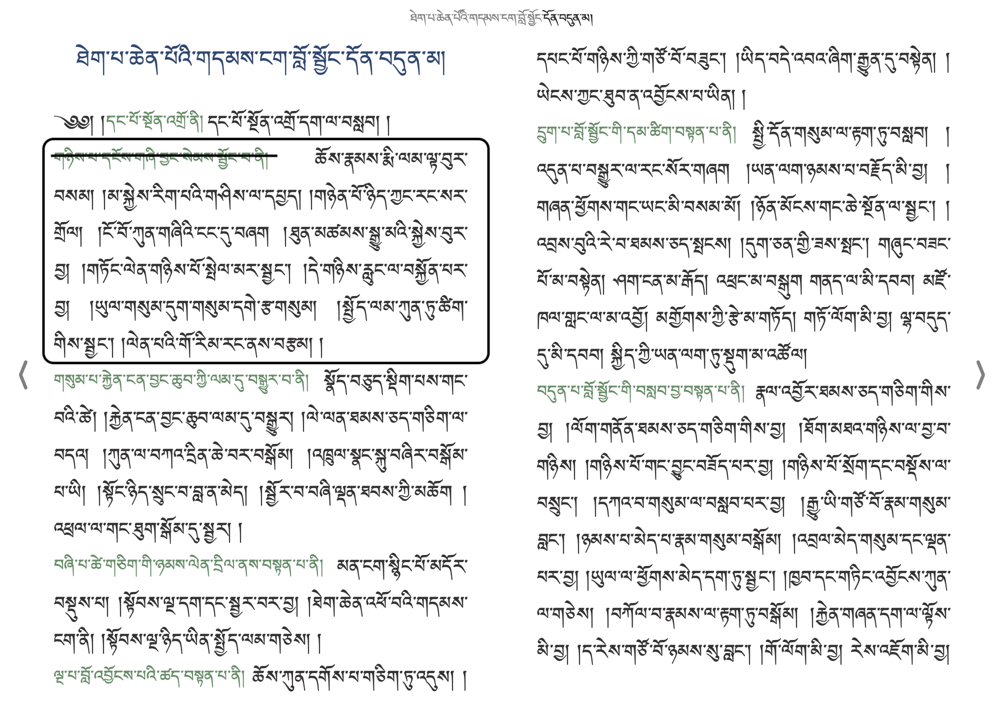


**Type:** Tibetan-Footnote

**Syntax:**
`
<span class="Tibetan-Footnote">...</span>`

**Description:** this tag indicates the Tibetan Footnote

**Text Sample:**

```
<span class="Tibetan-Footnote">གཉིས་པ་དངོས་གཞི་བྱང་སེམས་སྦྱོང་བ་ནི།</span>
```
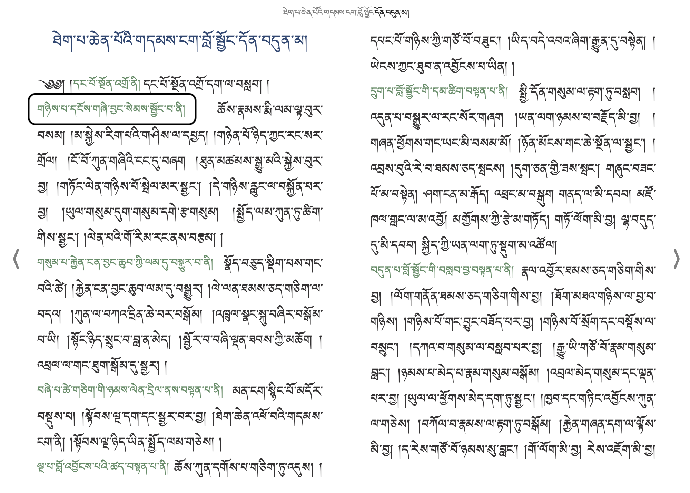


**Type:** Tibetan-External-Citations

**Syntax:**
`
<span class="Tibetan-External-Citations _idGenCharOverride-1">...</span>`

**Description:** this tag indicates the Tibetan External Citations

**Text Sample:**

```
<span class="Tibetan-External-Citations _idGenCharOverride-1">བྱམས་པའི་འཁོར་ལོ་སྔོན་དུ་འགྲོ། །</span>
```


**Type:** Tibetan-Sabche

**Syntax:**
`
<span class="Tibetan-Sabche _idGenCharOverride-1">...</span>`

**Description:** this span class tag indicates the Tibetan Sabche

**Text Sample:**

```
<span class="Tibetan-Sabche _idGenCharOverride-1">འདིར་བྱང་ཆུབ་ཀྱི་སེམས་སྒོམ་པའི་མན་ངག་ཁྱད་པར་དུ་འཕགས་པ་བློ་སྦྱོང་དོན་བདུན་མའི་ཁྲིད་སྟོན་པ་ལ་གསུམ། བརྒྱུད་པའི་བྱུང་ཁུངས། སྤྱིའི་དགོས་དོན། ཁྲིད་གཞུང་དངོས་འཆད་པའོ། །དང་པོ་༼བརྒྱུད་པའི་བྱུང་ཁུངས་༽ནི།</span>
```


**Type:** Tibetan-Root-Text

**Syntax:**
`
<span class="Tibetan-Root-Text _idGenCharOverride-1">...</span>`

**Description:** this tag indicates the Tibetan Root Text

**Text Sample:**

```
<span class="Tibetan-Root-Text _idGenCharOverride-1">དང་པོ་སྔོན་འགྲོ་དག་ལ་བསླབ། །</span>
```
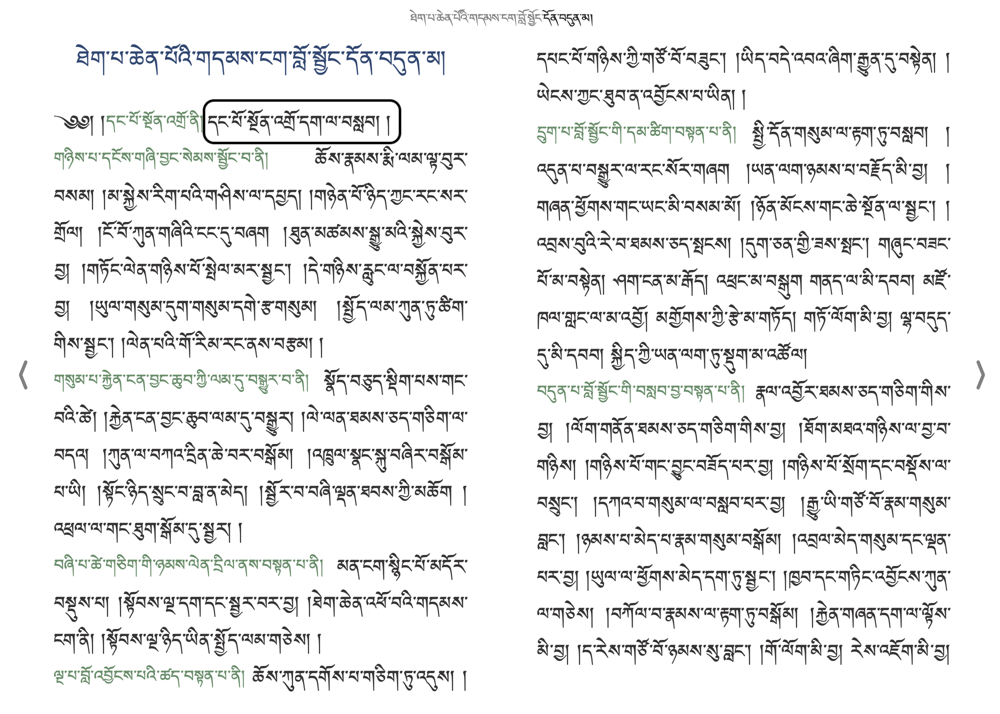
